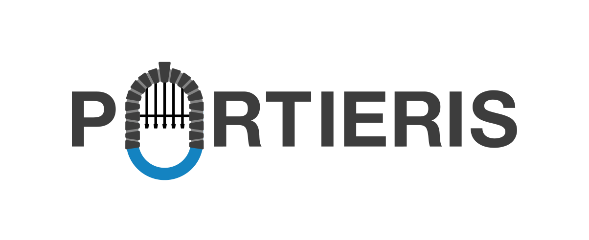

---

copyright:
  years: 2018, 2021
lastupdated: "2021-08-26"

---



[](https://travis-ci.org/IBM/portieris)

Portieris is a Kubernetes admission controller for the enforcement of image security policies. You can create image security policies for each Kubernetes namespace or at the cluster level, and enforce different rules for different images.

## How it works

Portieris uses a Kubernetes mutating admission webhook to modify your Kubernetes resources, at the point of creation, to ensure that Kubernetes runs only policy compliant images. When configured to do so, Portieris can enforce Docker Content Trust with optional trust pinning, or can verify signatures that are created by using Red Hat's simple signing model and prevents the creation of resources that use untrusted or unverified images.

If your cloud provider provides a [Notary](https://github.com/notaryproject/notary) server (sometimes referred to as Content Trust), Portieris accesses trust data in that Notary server that corresponds to the image that you are deploying. To verify Red Hat simple signatures, the signatures must be accessible by using registry extension APIs or a configured signature store.

When you create or edit a workload, the Kubernetes API server sends a request to Portieris. The AdmissionRequest contains the content of your workload. For each image in your workload, Portieris finds a matching security policy.

If trust enforcement is enabled in the policy, Portieris pulls signature information for your image from the corresponding Notary server and, if a signed version of the image exists, creates a JSON patch to edit the image name in the workload to the signed image by digest. If a signer is defined in the policy, Portieris additionally checks that the image is signed by the specified role, and verifies that the specified key was used to sign the image.

If simple signing is specified by the policy, Portieris verifies the signature by using the public key and identity rules that are supplied in the policy and, if verified, mutates the image name to a digest reference to ensure that concurrent tag changes can't influence the image that is being pulled.

While it is possible to require both Notary trust and simple signing, the two methods must agree on the signed digest for the image. If the two methods return different signed digests, the image is denied. Alternative signing methods are not allowed.

If any image in your workload does not satisfy the policy, the entire workload is prevented from deploying.

Portieris receives AdmissionRequests for the creation of, or edits to, all types of workload. To prevent Portieris from impacting auto-recovery, it approves requests where a known parent exists.

Portieris' Admission Webhook is configured to fail closed. Three instances of Portieris ensure that it is able to approve its own upgrades and auto-recovery. If all instances of Portieris are unavailable, Kubernetes doesn't auto-recover it, and you must delete the MutatingAdmissionWebhook to allow Portieris to recover.

## Image mutation option

The default behavior is to mutate the image reference on successful admission so that it references an image immutably by using a digest and not a tag. This behavior ensures that there is little possibility that an image can be substituted after verification by making changes in the image registry. Without this safeguard there is a time window between admission and image pull, and also between admission and any subsequent re-pull of the image due to rescheduling where an image under a tag can change. Switching the image to the digest form ensures that the image content is guaranteed to be the one admitted. 

Some closed loop deployment technologies verify that the image that is running is the expected one by looking at the image reference in the running container and seeing a mutated image reference as different, then attempt to correct the discrepancy, with no effect. In this case, an infinite reconciliation loop driving the Kubernetes API, Portieris, and registry traffic can start. To avoid this scenario, you can specify `mutateImage: false` in the policy behavior setting, which does not change the image that is admitted under this policy and prevents the undesirable consequences. The benefit is at the expense of reintroducing the window between admission and pull for other images to be substituted and run without verification.

Use this option only where absolutely necessary and don't use it alongside `trust` requirements because `notaryV1` tags aren't directly linked to registry tags and  unexpected images can run with trust verification even in the steady state (without registry changes).  
See, [Image mutation option](POLICIES.md#image-mutation-option).

## Portieris metrics

Portieris exposes two metrics for monitoring the policy decisions made for workload images, these metrics are available on port 8080, and are exposed by annotations to [Prometheus](https://prometheus.io/). The metrics are:

```
portieris_pod_admission_decision_allow_count
portieris_pod_admission_decision_deny_count
```

The metrics are counters that increment each time a decision is made.

These metrics are available to view locally on the `:8080/metrics` path for each pod that is running.

## Installing Portieris

Portieris is installed by using a Helm chart. Before you begin, ensure that you have Kubernetes 1.16, or later, on your cluster and Helm 3.0, or later, installed on your workstation.

* To install Portieris in the default namespace (`portieris`), complete the following steps:

  1. Find the release you want to run, see [Releases](https://github.com/IBM/portieris/releases), and download the Helm chart package. 
  2. Unpack the charts, for example, run: 
  
     ```
     tar xzvf portieris-0.9.4.tgz
     ```
     
  3. Generate your CA certificate as well as a certificate/key pair for your webhook server, signed by the CA you created. Add these to the `values.yaml` file under `UseGeneratedCerts`. Be sure to also set `enabled` to true. For more detailed instructions, see the README under `helm/portieris`.
  
  4. Run:
  
     ```
     helm install portieris --create-namespace --namespace portieris ./portieris
     ``` 

* To install Portieris in a different namespace, including an existing one, omit the `--create-namespace` option. Because the namespace forms part of the webhook certificate common name, you must generate the certificate for the target namespace.

  1. Run:
     
     ```
     sh portieris/gencerts <namespace>
     ```
     
  2. Run:
  
     ```
     helm install portieris --create-namespace --namespace <namespace> ./portieris
     ```

* To manage certificates through an installed [cert-manager](https://cert-manager.io/), you don't need to unpack the charts. 

  1. Run:

     ```
     helm install portieris --set UseCertManager=true portieris-0.9.4.tgz
     ```

By default, Portieris' admission webhook runs in all namespaces including its own install namespace, so that Portieris is able to review all the pods in the cluster. However, this can prevent the cluster from self-healing in the event that Portieris becomes unavailable. 

Portieris also supports skipping namespaces with a certain label set. You can enable this by adding `--set AllowAdmissionSkip=true` to your installation command, but ensure that you control who can add labels to namespaces and who can access namespaces with this label so that a malicious party can't use this label to bypass Portieris.

Another way to avoid update deadlock is to specify `--set webHooks.failurePolicy=Ignore`. 

## Uninstalling Portieris

**Note**: When you uninstall Portieris, all your image security policies are deleted.

To uninstall Portieris run: 

```
helm delete portieris --namespace <namespace>
```

**Note**:

* If you no longer require the namespace, you must delete it manually by running: 
  
  ```
  kubectl delete namespace/<namespace>
  ```
  
* If you have issues uninstalling Portieris by using Helm, try running the clean-up script: 
  
  ```
  helm/cleanup.sh portieris <namespace>
  ```

## Image security policies

Image security policies define Portieris' behavior in your cluster. You must configure your own policies in order for Portieris to enforce your required security posture. [Policies](POLICIES.md) are described separately.

## Configuring access controls for your security policies

You can configure Kubernetes role-based access control (RBAC) rules to define which users and applications can modify your security policies. For more information, see the [Kubernetes](https://kubernetes.io/docs/reference/access-authn-authz/rbac/) docs and [Controlling user access with IBM Cloud IAM and Kubernetes RBAC](https://cloud.ibm.com/docs/containers?topic=containers-users) in the IBM Cloud Kubernetes Service docs.

If Portieris is installed with `AllowAdmissionSkip=true`, you can prevent Portieris' admission webhook from being called in specific namespaces by labelling the namespace with `securityenforcement.admission.cloud.ibm.com/namespace: skip`. This action allows pods in that namespace to recover when the admission webhook is down, but note that no policies are applied in that namespace. For example, the Portieris installation namespace is configured with this label to allow Portieris itself to recover when it is down. Ensure that you control who can add labels to namespaces and who can access namespaces with this label so that a malicious party can't use this label to bypass Portieris.

## Reporting security issues

To report a security issue, don't open an issue. Instead, send your report by email to `alchreg@uk.ibm.com` privately.
